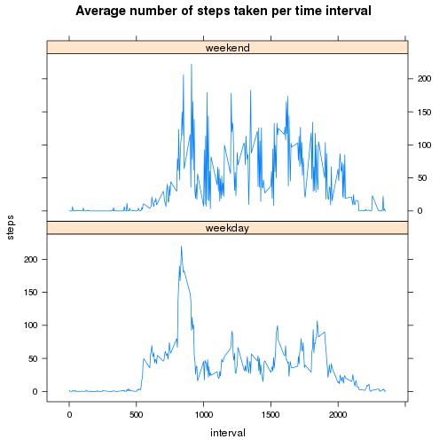

## Reproducible Research: Peer Assessment 1


## Loading and preprocessing the data

```r
file_ls <- as.character(unzip('activity.zip', list = TRUE)$Name)  
for (i in file_ls) activity <- read.csv(unz("activity.zip", i), 
					na.strings="NA", 
					colClasses = c("integer", "Date", "integer")) 
```


## What is mean total number of steps taken per day?

```r
plot1data <-  aggregate(x = activity$steps, by = list(activity$date), FUN = "sum")
names(plot1data) <- c("date", "steps")
plot(plot1data, type = "h", main = "Histogram of the total number of steps taken each day")
```

 

**Mean** and **median** total number of steps taken per day are 
**1.0766 &times; 10<sup>4</sup>** and **10765**,
respectively.

## What is the average daily activity pattern?

```r
plot2data <- with(na.omit(activity),
		 aggregate(x =steps, by = list(interval), FUN="mean"))
names(plot2data) <- c("interval", "steps")
plot(plot2data, type = "l", main = "Steps taken on average across all days")
```

 

**835** 5-minute interval, on average across all the days in the dataset, contains the **maximum** number of steps.

## Imputing missing values

Total number of missing values in the dataset is **2304**. These only appear in the **steps** column.


To fill in all of the missing values in the dataset we're going to use the **mean** value for the particular time **interval**. 


```r
for (row in which(is.na(activity_imputed$steps))) 
	activity_imputed[row,]$steps <- plot2data[which(plot2data$interval == activity_imputed[row,]$interval),]$steps 

plot3data <-  aggregate(x = activity_imputed$steps, by = list(activity_imputed$date), FUN = "sum")
names(plot3data) <- c("date", "steps")
plot(plot3data, type = "h", main = "Histogram of the total number of steps taken each day,\nwith missing values filled")
```

 

**Mean** and **median** total number of steps taken per day after imputing are 
**1.0766 &times; 10<sup>4</sup>** and **1.0766 &times; 10<sup>4</sup>**,
respectively. As we may see, these values don't differ from the original estimates very much. On the histogram, though, it seems that the replaced missing values are mostly close to the mean.
## Are there differences in activity patterns between weekdays and weekends?

```r
activity_imputed$weekfact <- factor(ifelse(weekdays(activity_imputed$date)==c("Saturday", "Sunday"), "weekend", "weekday"))
plot4data <- with(activity_imputed,
		 aggregate(x =steps, by = list(interval, weekfact), FUN="mean"))
names(plot4data) <- c("interval", "weekfact", "steps")
library(lattice)
xyplot(steps ~ interval | weekfact, data = plot4data, layout = c(1,2), type = "l", 
       main = "Average number of steps taken per time interval")
```

 

It seems that people are more active on weekends. Probably they do sports or party.
